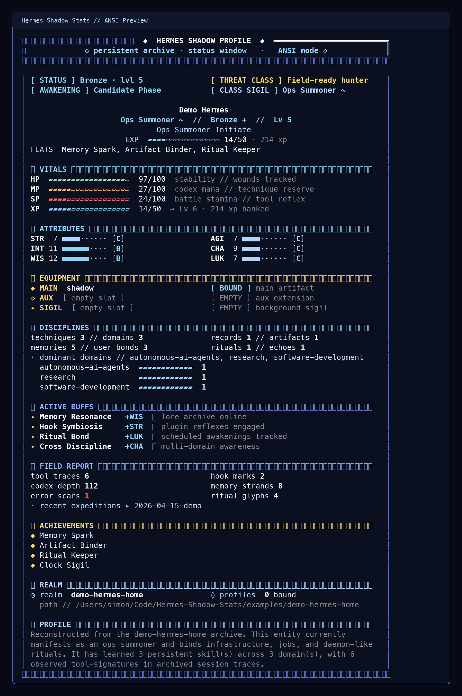

# Hermes Shadow Stats

> **A status window for watching your agent awaken, adapt, and level up.**
>
> Hermes Shadow Stats scans persistent Hermes artifacts — memory, skills, sessions, plugins, cron traces — and reconstructs them as an ANSI-first hunter interface with pixel-terminal energy and Solo Leveling mood.

<p align="center">
  <a href="https://github.com/EndeavorYen/Hermes-Shadow-Stats/actions/workflows/test.yml"></a>
  <a href="./LICENSE"></a>
  
  
</p>

<p align="center">
  <strong>ANSI-first</strong> • <strong>CLI-native</strong> • <strong>read-only</strong> • <strong>artifact-driven</strong>
</p>

<p align="center">
  
</p>

Hermes Shadow Stats is built around one very specific fantasy:

**You are not just running an agent. You are watching it level up.**

Not as empty gamification, but as a visible growth loop:

- memories become adaptation
- skills become unlocked techniques
- sessions become battle history
- plugins become artifacts and summons
- cron becomes autonomous power

That slightly over-the-top, unapologetically cool feeling matters.

**The point is to make agent growth feel visible, dramatic, and a little bit chuunibyou — in the best possible way.**

Instead of patching Hermes core, this project reads the artifacts Hermes already leaves behind and turns them into a dramatic status interface you can drop directly into a terminal workflow.

That makes it:

- fast to iterate on
- easy to integrate with CLI tools
- fun to share in screenshots
- low-coupling with Hermes internals

---

## Hero demo

This preview is generated from the stable synthetic demo profile under `examples/demo-hermes-home/`.

```text
╭───────────────────────── HERMES SHADOW PROFILE ─────────────────────────╮
│                    persistent archive // status window                  │
╰──────────────────────────────────────────────────────────────────────────╯

│ [ STATUS ] Bronze rank // lvl 5         [ THREAT CLASS ] Field-ready hunter    │
│ [ AWAKENING ] Candidate Phase           [ CLASS SIGIL ] Ops Summoner ~         │
│                                                                                │
│                                  Demo Hermes                                   │
│                        Ops Summoner // Bronze + // Lv 5                        │
│                             Ops Summoner Initiate                              │
│ CLASS SIGIL  ~                          EXP  ▰▰▰▰▱▱▱▱▱▱▱▱▱▱▱▱ 14/50 · 214 xp   │
│ FEATS  Memory Spark, Artifact Binder, Ritual Keeper                            │
```

This is the fantasy in one screen:

**your agent is not just running tasks — it is becoming stronger.**

---

## Why this is interesting

Most agent dashboards feel like telemetry.

Hermes Shadow Stats is trying to feel like **presence**.

Not just a monitor. Not just a parser. Not just a dashboard.

A status window.

It is also trying to capture a very specific Solo Leveling-adjacent feeling:

> the moment you realize the system is not static —
> your agent is learning, surviving, unlocking, and becoming something stronger.

It maps:

- persistent memory → lore / adaptation
- skills → unlocked techniques
- sessions → battle history
- plugins → extensions / artifacts
- cron → autonomy / summons / rituals

into a terminal-native panel that feels closer to:

- Hermes Agent's pixel-ish CLI charm
- a dungeon system prompt
- a hunter status window from *Solo Leveling*

---

## Current vibe

- ANSI is the **main product**, not a side export
- blue / deep-blue / gold terminal palette
- blocky pixel-ish frame language
- hunter-rank / system-window tone
- markdown + JSON are still available as utility outputs
- SVG exists, but the current design direction is **ANSI first**

---

## Why people might star this

### 1. It gives agents visible progression
- Level / EXP
- STR / INT / WIS / AGI / CHA / LUK
- rank, title, and primary class
- threat evaluation
- achievements / unlocked titles
- narrative summary

### 2. It turns real artifacts into fantasy signals
- memory depth
- skill codex size
- session tool-signatures
- session error scars
- plugin manifest / hook traces
- cron schedule glyphs

### 3. It is actually usable in a terminal
- ANSI status window renderer
- markdown renderer
- JSON export
- optional SVG renderer for side experiments
- CLI-friendly output
- read-only scanning approach

### 4. It can evolve into deeper Hermes integration
- Hermes plugin prototype wrapper
- future growth journal / progression history
- future profile comparisons / live overlays

---

## Quickstart

```bash
git clone https://github.com/EndeavorYen/Hermes-Shadow-Stats.git
cd Hermes-Shadow-Stats
python -m venv .venv
source .venv/bin/activate
pip install -e .
hermes-shadow-stats
```

If you already have Hermes installed locally, this will scan `~/.hermes` by default.

In the best case, your first run should feel like this:

> "oh, this is not a metrics panel — this is my agent's awakening screen."

---

## Try it in 10 seconds

### Interactive TUI (v0.2.0+)

```bash
# launch the 8-tab interactive Textual TUI (default on a TTY)
hermes-shadow-stats

# or explicitly
hermes-shadow-stats --tui
```

Keys: `←/→` or `h/l` cycle tabs · `1`-`8` jump to tab · `Enter` drills into
Detail (Journal/Chronicle/Codex/Rituals) · `Esc` backs out · `r`/F5 refreshes
the snapshot · `?` shows help · `q` or `Ctrl+C` quits cleanly.

The TUI pulls primary telemetry from `~/.hermes/state.db` (schema v6+, read-only)
and falls back to the file scanner with a visible banner in the Status tab when
the database is absent, schema-mismatched, or unreadable.

### ANSI mode (static, legacy-compatible)

```bash
# legacy single-panel output, byte-identical to v0.1.x
hermes-shadow-stats --no-tui
# or
hermes-shadow-stats --format ansi
```

### 8-tab static concat

```bash
# all 8 RPG tabs rendered to stdout (new in v0.2.0)
hermes-shadow-stats --format tabs
```

### Theme

```bash
# v1 ships one built-in theme; more will land in v0.3
hermes-shadow-stats --theme hermes-teal
```

### Banner modes for the CLI hero/logo

```bash
# auto: picks wide / compact / minimal from terminal width
hermes-shadow-stats --banner-mode auto

# force the big banner treatment
hermes-shadow-stats --banner-mode wide

# force a shorter text-mode banner for narrower terminals
hermes-shadow-stats --banner-mode compact

# fall back to a very small header-safe mode
hermes-shadow-stats --banner-mode minimal
```

The CLI now ships with a **Unicode + ANSI banner path** rather than a single fixed header. Wide terminals get the large block-logo treatment, medium terminals get a shorter banner, and narrow terminals fall back to a compact status-window header instead of breaking alignment.

### Markdown mode

```bash
hermes-shadow-stats --format markdown
```

### JSON mode

```bash
hermes-shadow-stats --format json
```

### Custom Hermes home / custom display name

```bash
hermes-shadow-stats --hermes-home ~/.hermes --name "Hermes of Ashes"
```

### Regenerate the README preview image

```bash
python scripts/render_readme_preview.py
```

### Generate stable example outputs from the synthetic demo profile

```bash
./scripts/generate_example_outputs.sh
```

---

## Why ANSI first?

Because this project wants to live **inside the CLI**, not beside it.

If the fantasy is "my agent is leveling up in front of me," then the terminal is the right stage.

ANSI gives us:

- direct fusion with terminal workflows
- immediate compatibility with Hermes-style interfaces
- shareable screenshots without needing a browser
- a tighter aesthetic loop between data and atmosphere

For now, the design priority is:

1. make the terminal panel feel great
2. make the terminal panel feel iconic
3. only then care about richer graphical outputs

So yes: SVG/PNG exist, but they are **not the hero path right now**.

---

## Design principles

- **Read-only first** — no Hermes core surgery required
- **Flavor over fake precision** — numbers are derived, not pretending to be authoritative telemetry
- **CLI-native** — terminal experience is the main target
- **Low coupling** — the scanner should survive Hermes evolution better than a deep integration would
- **Fun matters** — this should feel cool, not just correct

---

## How it works

Hermes Shadow Stats scans:

- `memories/MEMORY.md`
- `memories/USER.md`
- `skills/**/SKILL.md`
- `sessions/`
- `profiles/`
- `plugins/`
- `logs/`
- `cron/`

Then it derives:

- stats
- classes
- titles
- achievements
- threat level flavor
- summary text

without modifying Hermes itself.

---

## Hermes plugin prototype

A lightweight plugin prototype is included under:

- `hermes_plugin/`

See:
- `docs/plugin-prototype.md`

This is intentionally conservative for now. The current bet is:

**ship the ANSI interface first, then deepen integration later.**

---

## Documentation

- `docs/design.md` — system design and derivation logic
- `docs/plugin-prototype.md` — plugin wrapper notes
- `docs/release-checklist.md` — release polish checklist
- `examples/README.md` — sample output guidance
- `CHANGELOG.md` — project changes
- `scripts/render_readme_preview.py` — regenerate the social/README preview image

---

## Roadmap

### Near-term
- make the ANSI panel feel even more like a live leveling-up interface
- add stronger pixel motifs / badge language / class emblems
- tune class/title progression so growth feels more narratively satisfying
- add stable synthetic demo profiles for public examples

### Mid-term
- parse session structures more deeply instead of using only heuristics
- add growth journal / progression history
- improve plugin-mode UX

### Later
- portraits
- richer card variants
- comparative panels across profiles
- hook-based live progression

---

## Contributing / experimenting

If you like agent UX, terminal aesthetics, RPG systems, or weirdly emotional tooling, this repo is very open to experimentation.

Good contribution directions:

- better ANSI layout ideas
- stronger rank / class naming
- better achievement logic
- synthetic demo datasets
- plugin integration ideas
- terminal screenshot-worthy polish

---

## License

MIT — see `LICENSE`.
